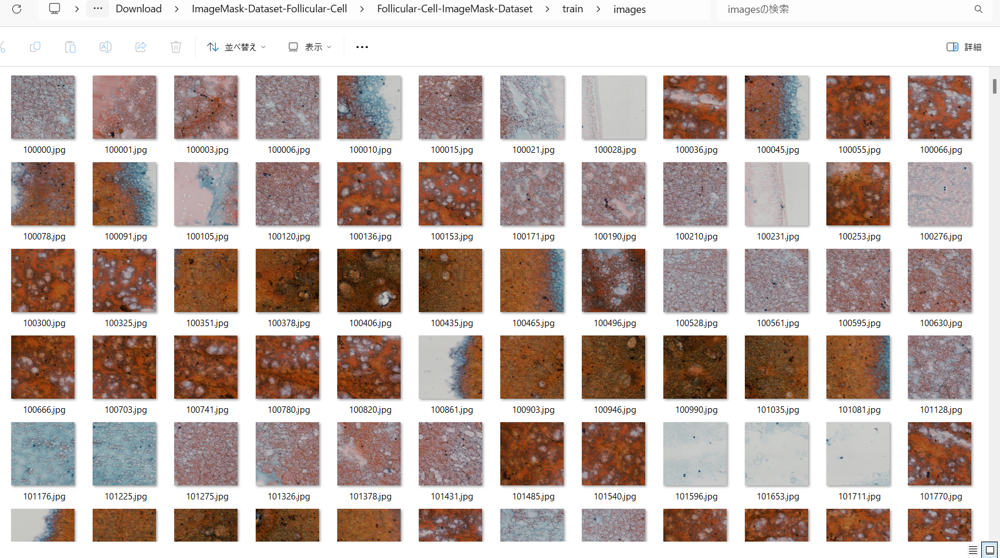
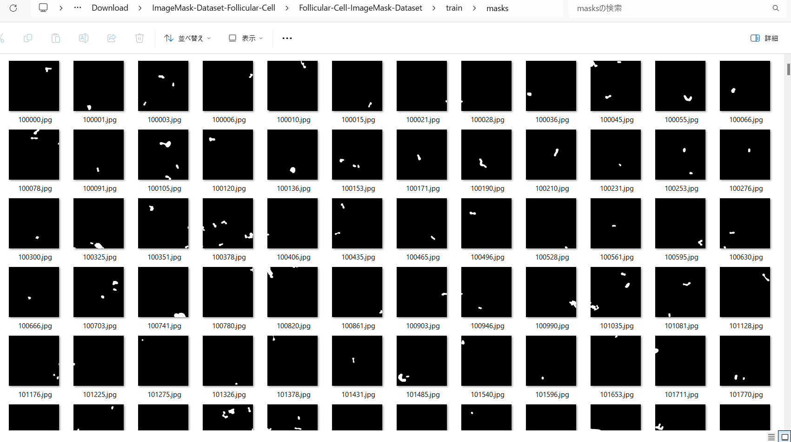
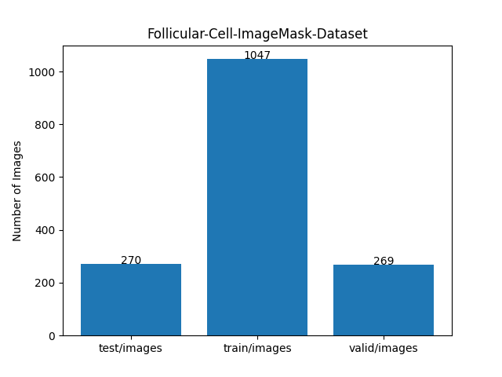

<h2>ImageMask-Dataset-Follicular-Cell (2024/09/27)</h2>

This is ImageMask Dataset for Follicular-Cell<a href="https://github.com/bupt-ai-cz/Hybrid-Model-Enabling-Highly-Efficient-Follicular-Segmentation">
Hybrid-Model-Enabling-Highly-Efficient-Follicular-Segmentation</a>
 
The original Follicular-Cell Patch Dataset can be downloaded from the google drive 

<a href="https://drive.google.com/file/d/1t1W7tpKscqLxPApqH3JSP_zsljLHWKxQ/view?usp=sharing">IM_PatchDataset.zip</a>.

 
 
<b>Download Follicular Cell ImageMask-Dataset</b> 
You can download our 512x512 pixels Follicular Cell ImageMask-Dataset, derived by us from the original IM_PatchDataset, from the google drive 
<a href="https://drive.google.com/file/d/1M2jJGmNw5frlRfExxVQrdnkg-tnmHzvh/view?usp=sharing">
Follicular-Cell-ImageMask-Dataset.zip</a>
 

<h3>1. Dataset Citation</h3>
Please cite these papers in your publications if it helps your research: 
<a href="https://www.sciencedirect.com/science/article/pii/S2667102621000036">
<b>pdf of Intelligent Medicine</b>
</a>
<pre>
@article{zhu2021hybrid,
  title={Hybrid model enabling highly efficient follicular segmentation in thyroid cytopathological whole slide image},
  author={Zhu, Chuang and Tao, Siyan and Chen, Huang and Li, Minzhen and Wang, Ying and Liu, Jun and Jin, Mulan},
  journal={Intelligent Medicine},
  year={2021},
  publisher={Elsevier}
}
</pre>

<h3>2. Download Follicular-Cell</h3>

If you would like to create Follicular Cell ImageMask Dataset by yourself,
please download the original PatchDataset from the google drive 
<a href="https://drive.google.com/file/d/1t1W7tpKscqLxPApqH3JSP_zsljLHWKxQ/view?usp=sharing">IM_PatchDataset.zip</a>.
 
It contains the following testing set and training set of 1024x1024 pixels png files. 
<pre>
./patch dataset
├─testing set
│  ├─data
│  │  ├─background
│  │  ├─jiaozhi
│  │  └─lvpao
│  ├─label
│  │  ├─background
│  │  ├─jiaozhi
│  │  └─lvpao
│  └─label_transfered
│      ├─background
│      ├─jiaozhi
│      └─lvpao
└─training set
    ├─data
    │  ├─background
    │  ├─jiaozhi
    │  └─lvpao
    ├─label
    │  ├─background
    │  ├─jiaozhi
    │  └─lvpao
    └─label_transfered
        ├─background
        ├─jiaozhi
        └─lvpao
</pre>

 
<h3>3. ImageMaskDataset Generation</h3>

Please run the following command for Python script <a href="./ImageMaskDatasetGenerator.py">ImageMaskDatasetGenerator.py</a>.
 
<pre>
> python ImageMaskDatasetGenerator.py
</pre>
This command will generate 512x512 jpg image mask dataset from <b>lvpao</b> in data and label_transfered of testing set and training set. 
<pre>
./Follicular-Cell-master
├─test
│  ├─images
│  └─masks
└─train
    ├─images
    └─masks
</pre>

 
<h3>4. Split master </h3>

Please run the following command for Python script <a href="./split_master.py">split_master.py</a>.
 
<pre>
> python ImageMaskDatasetGenerator.py
</pre>
This command will generate 512x512 jpg image mask dataset from lvpao subsets in testing_set and training_set. 
<pre>
./ImageMask-Dataset-Follicular-Cell
├─test
│  ├─images
│  └─masks
├─train
│  ├─images
│  └─masks
└─valid
    ├─images
    └─masks
</pre>

Train images sample 
  
Train mask sample 
  

Dataset Statistics  
 

<h3>Reference</h3>
<b>1. Hybrid model enabling highly efficient follicular segmentation  
in thyroid cytopathological whole slide image </b> 
Chuang Zhu, Siyan Tao, Huang Chen, Minzhen Li, Ying Wang, Jun Liu, Mulan Jin 

https://doi.org/10.1016/j.imed.2021.04.002 
<a href="https://www.sciencedirect.com/science/article/pii/S2667102621000036">https://www.sciencedirect.com/science/article/pii/S2667102621000036</a>

